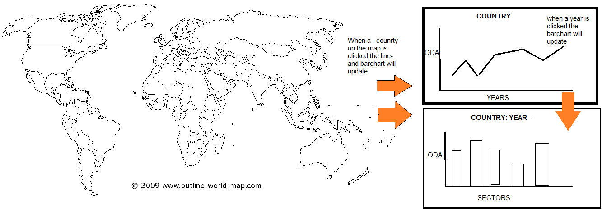

#Design Document

In my design I want to people be able to compare the Official Aid Development (ODA) that certain countries give, this will be made possible through an interactive map. By clicking on a country you can compare the amount of ODA that has given over the past 10 years, through line-graph. And then by clicking on a year on the graph, a bar chart appears that shows the ODA given per sector of that year.
When an element is clicked the other elements need to change to show the new data. 

My datasource is the Organisation for Economic Co-operation and Development (OECD), and my data can be found on this site: http://stats.oecd.org/Index.aspx?datasetcode=TABLE5
This data I have stored in a JSON file, which the javascript code will call, but I might reformat the data in JavaScript, if that is necessary for the functioning of my code.

