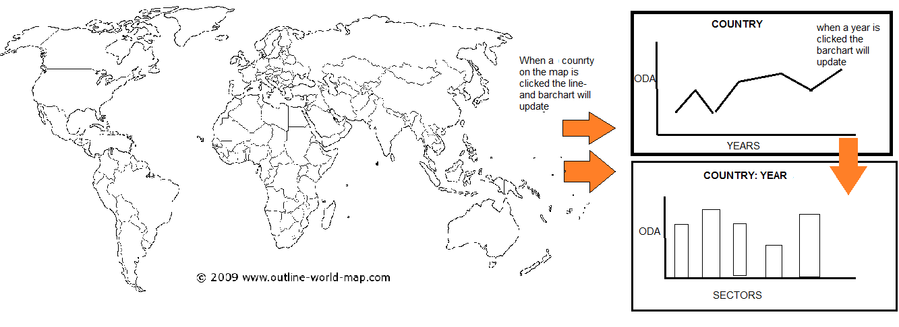

# programmeerproject

My data has the goal to show the amount of Official Development  Aid (ODA) that a country gives. The visualization shows in the first instance a map where you can see the countries that give ODA, the different amounts of aid received/given is shown through a gradient color scale/ When you click on one of the countries a timeline shows up, which shows the given/received ODA of various years of the selected country. Then when a year within that you can see the different sectors that received the aid, which will be visualized with a bar chart.

The problem I hope to solve with this visualization is to show in a clear way how much money is spend on developmental aid, and on what sectors it has been spend throughout the years. 

I will use the databases from the Organisation for Economic Co-operation and Development (OECD) (http://stats.oecd.org/Index.aspx?datasetcode=TABLE5), which works close with ODA. I want to set these data in a JSON format.

A similar visualization can be found on the site of the OECD but shows only a map that only shows how much a of the aid a country receives is ODA.  

The data has been collected in JSON form, but in a very large format:

[[country1, sector1, year1, aid1], [country1, sector1, year2, aid2]......[countryN, sectorN, yearN, aidN]]

To make te data more useful for both creating the linegraph as thebarchart  I want to import the linegraph data like this:

{Country1 : [sector1[year1, aid1], [year2, aid2] ..], [sector2[year1,aid1].....]}

And for the bar graph:

{Country1 : [year1[sector1, aid1], [sector2, aid2] ..], [year2[sector1,aid1]....]}.
